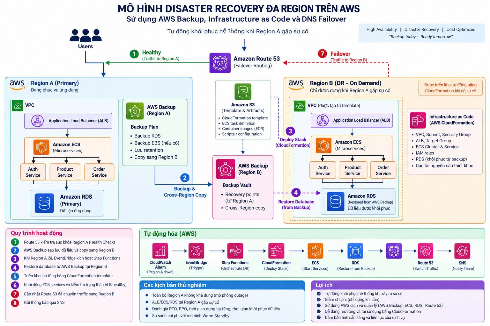

# NT533 — Low-Cost Multi-Region Disaster Recovery (DR) trên AWS

Dự án này triển khai giải pháp **Disaster Recovery (DR) Multi-Region** tối ưu chi phí theo chiến lược **Backup & Restore** giữa hai AWS Regions:
- **Primary Region — Sydney (`ap-southeast-2`)**: Chạy toàn bộ workload môi trường **production** (VPC, NAT Gateway, Application Load Balancer, ECS Fargate microservices, RDS PostgreSQL).
- **Secondary / DR Region — Singapore (`ap-southeast-1`)**: Đóng vai trò **Cold Standby** nhằm tối ưu chi phí tối đa. Ở trạng thái bình thường, Singapore **không chạy compute, không bật RDS, không có ALB hay NAT Gateway** (chi phí standby gần như bằng $0). Singapore chỉ lưu trữ bản sao backup (AWS Backup Vault), image container được đồng bộ (ECR Replication), file template CloudFormation (S3) và bộ não điều phối tự động (Step Functions, EventBridge, Lambda, DynamoDB Singleton Lock).

---

## 1. Mô hình Kiến trúc Hệ thống



### 1.1 Cơ chế Hoạt động Bình thường (Normal Operation)
- **Truy cập người dùng:** Route 53 định tuyến traffic qua bản ghi Failover **PRIMARY** trỏ về Application Load Balancer (ALB) tại Sydney.
- **Tầng ứng dụng:** ALB phân phối traffic đến 3 dịch vụ ECS Fargate độc lập (`auth`, `product`, `order`), lắng nghe tại cổng `8080`.
- **Tầng dữ liệu:** RDS PostgreSQL 16 nằm trong Private DB Subnet độc lập, cấu hình tự động backup và mã hóa bằng AWS KMS.
- **Sao lưu & Đồng bộ:**
  - **Dữ liệu:** AWS Backup định kỳ (mỗi 6 giờ) tạo snapshot và tự động copy cross-region sang **Backup Vault tại Singapore**.
  - **Image:** ECR tại Sydney được cấu hình cross-region replication tự động đồng bộ mọi image container mới sang **ECR Singapore**.
  - **Secret:** AWS Secrets Manager tự động sao chép mật khẩu database từ Sydney sang bản replica tại Singapore.

### 1.2 Quy trình Tự động Phục hồi khi có Thảm họa (Disaster Recovery Workflow)
```text
Sự cố tại Sydney (Tất cả 3 dịch vụ mất kết nối)
  └──> CloudWatch Composite Alarm (Sydney) chuyển trạng thái ALARM
        └──> EventBridge Rule (Sydney) chuyển tiếp event cross-region sang Singapore
              └──> AWS Step Functions State Machine (Singapore) kích hoạt:
                    ├──> Gate 1: Delay 90s và kiểm tra lại Alarm tại Sydney (chống False Positive)
                    ├──> Gate 2: Chiếm Singleton Lock trên DynamoDB (ngăn chặn duplicate restore)
                    ├──> Bước 1: CloudFormation tạo DR Runtime Stack (VPC, NAT, ALB, ECS desiredCount=0)
                    ├──> Bước 2: Tìm Recovery Point mới nhất tại Singapore Vault -> Gọi AWS Backup khôi phục RDS
                    ├──> Bước 3: Lambda cập nhật Runtime Secret (ghép mật khẩu replicate + endpoint RDS mới)
                    ├──> Bước 4: Scale ECS Fargate desiredCount = 1 -> Chờ cả 3 Target Groups pass TCP Health Check
                    ├──> Gate 3: Kiểm tra Primary Alarm lần cuối ngay trước khi cutover DNS
                    ├──> Bước 5: UPSERT bản ghi Route 53 SECONDARY Failover Alias
                    └──> Bước 6: Gửi thông báo hoàn tất phục hồi qua SNS (Email)
```

### 1.3 Đánh giá Chiến lược DR
- **Chi phí Standby tối thiểu:** Bình thường không phải trả phí cho database hay cụm compute chạy ngầm ở Singapore.
- **Đánh đổi RTO / RPO:**
  - **RTO (Recovery Time Objective):** Thời gian phục hồi dự kiến từ 20–40 phút (phụ thuộc vào thời gian CloudFormation dựng VPC/ALB và AWS Backup restore dữ liệu RDS).
  - **RPO (Recovery Point Objective):** Chu kỳ backup 6 giờ, RPO lý thuyết ≤ 6 giờ cộng độ trễ sao chép cross-region.

---

## 2. Cấu trúc Repository

```text
NT533/
├── image.jpg                          # Sơ đồ kiến trúc hệ thống DR
├── app/demo/                          # Ứng dụng demo microservices (Python)
│   ├── app.py                         # HTTP server: probe /health TCP tới RDS, endpoints service
│   ├── Dockerfile                     # Docker image đóng gói ứng dụng
│   └── .dockerignore
├── cloudformation/
│   ├── bootstrap/                     # Hạ tầng nền tảng khởi tạo trước
│   │   ├── regional-baseline.yaml     # Tạo S3 artifact bucket, KMS key & Backup Vault tại mỗi Region
│   │   └── dr-ecr.yaml                # Tạo ECR repositories bảo mật tại Singapore
│   ├── primary/                       # IaC Primary Region (Sydney)
│   │   ├── root-primary.yaml          # Master nested stack Sydney
│   │   ├── network.yaml               # VPC, Subnets (Public, Private App, Private DB), IGW, NAT
│   │   ├── security.yaml              # Security Groups (ALB, ECS, RDS)
│   │   ├── alb.yaml                   # ALB, Listeners, Target Groups cho 3 service
│   │   ├── ecs.yaml                   # ECS Cluster, Task Definitions, Services (auth, product, order)
│   │   ├── rds.yaml                   # RDS PostgreSQL 16, DB Subnet Group, KMS Encryption
│   │   ├── ecr.yaml                   # ECR Repositories & Cross-Region Replication Rule
│   │   ├── backup.yaml                # AWS Backup Plan, Rules & Cross-Region Copy to Singapore
│   │   ├── route53.yaml               # Route 53 PRIMARY Failover Alias Record & Health Check
│   │   └── monitoring.yaml            # CloudWatch Metric Alarms & Composite Alarm
│   ├── dr/                            # IaC DR Runtime Region (Singapore - chỉ tạo on-demand khi DR)
│   │   ├── root-dr.yaml               # Master nested stack DR
│   │   ├── network.yaml               # VPC DR, Subnets, Single NAT Gateway
│   │   ├── security.yaml              # Security Groups DR
│   │   ├── alb.yaml                   # ALB DR
│   │   ├── iam.yaml                   # Task execution roles cho ECS DR
│   │   ├── ecs.yaml                   # ECS Cluster & Services (khởi tạo với desired count = 0)
│   │   └── monitoring.yaml            # CloudWatch Dashboard theo dõi DR runtime
│   ├── automation/                    # IaC Control Plane Điều phối Phục hồi (Singapore)
│   │   ├── root-automation.yaml       # Master stack tự động hóa
│   │   ├── stepfunctions.yaml         # AWS Step Functions State Machine (57 states)
│   │   ├── lock.yaml                  # DynamoDB table lưu singleton lock có TTL
│   │   ├── iam.yaml                   # Quyền hạn chi tiết cho Step Functions, Lambda, Backup
│   │   ├── sns.yaml                   # SNS Topic thông báo sự cố có mã hóa KMS
│   │   ├── eventbridge-dr.yaml        # Event Bus & Rule tại Singapore nhận trigger
│   │   ├── eventbridge-primary.yaml   # Rule tại Sydney forward alarm sang Singapore
│   │   └── lambda/                    # 7 Lambda functions thực thi đơn nhiệm:
│   │       ├── check-primary/         # Kiểm tra trạng thái CloudWatch alarm Sydney
│   │       ├── manage-lock/           # Chiếm / giải phóng lock DynamoDB có điều kiện
│   │       ├── find-recovery-point/   # Tìm recovery point RDS hợp lệ mới nhất tại DR Vault
│   │       ├── start-restore/         # Khởi động AWS Backup restore job cho RDS
│   │       ├── update-secret/         # Ghép secret replica và endpoint DB thành runtime secret
│   │       ├── parse-stack-outputs/   # Parse outputs từ CloudFormation DR stack
│   │       └── check-alb/             # Xác thực cả 3 Target Groups đã đạt trạng thái Healthy
│   ├── parameters/                    # File cấu hình tham số mẫu
│   │   ├── prod-primary.json          # Tham số cho Primary Stack
│   │   ├── prod-dr.json               # Tham số cho DR Runtime Stack
│   │   └── prod-automation.json       # Tham số cho Automation Stack
│   └── scripts/                       # Bộ công cụ script PowerShell
│       ├── validate.ps1               # Kiểm tra cú pháp, cfn-lint và ASL JSON
│       ├── package.ps1                # Đóng gói nested templates và upload lên S3
│       ├── publish-images.ps1         # Build và push Docker images lên ECR Sydney
│       ├── invoke-dr-test.ps1         # Kích hoạt diễn tập DR an toàn
│       └── cleanup-dr-test.ps1        # Dọn dẹp tài nguyên DR an toàn sau diễn tập
└── README.md
```

---

## 3. Yêu cầu Chuẩn bị (Prerequisites)

Trước khi thực hiện triển khai, môi trường của bạn cần chuẩn bị:
1. **Hệ điều hành & Shell:** Windows PowerShell hoặc PowerShell Core (`pwsh`).
2. **AWS CLI v2:** Đã cài đặt và đã xác thực phiên làm việc (`aws sts get-caller-identity`).
3. **Docker Desktop:** Đang chạy để build và push container image.
4. **Python & Linter (Tùy chọn để kiểm tra code):**
   - Đã cài đặt `uv` hoặc `pip` với `cfn-lint`.
5. **Tên miền & DNS:**
   - 01 Route 53 Public Hosted Zone đang quản lý tên miền của bạn (ví dụ: `skycert.site`).
   - Ghi lại **Hosted Zone ID** và tên miền con dự kiến (ví dụ: `app.skycert.site`).
6. **Không trùng dải mạng:**
   - Primary CIDR: `10.10.0.0/16` (Sydney)
   - DR CIDR: `10.20.0.0/16` (Singapore)

---

## 4. Hướng dẫn Triển khai Chi tiết (Step-by-Step Deployment)

Toàn bộ quy trình triển khai được chuẩn hóa qua các giai đoạn sau:

### Giai đoạn 0: Khởi tạo Biến & Kiểm tra Tài khoản
Mở PowerShell tại thư mục gốc của repository:

```powershell
# 1. Lấy Account ID và xác thực AWS CLI
$accountId = aws sts get-caller-identity --query Account --output text
Write-Host "Deploying to AWS Account ID: $accountId"

# 2. Thiết lập các thông số cơ bản
$primaryRegion = "ap-southeast-2"    # Sydney
$drRegion      = "ap-southeast-1"    # Singapore
$primaryBucket = "prod-dr-cfn-artifacts-$accountId-$primaryRegion"
$drBucket      = "prod-dr-cfn-artifacts-$accountId-$drRegion"
$releaseVer    = "v1.0.1"            # Định danh phiên bản đóng gói
$domainName    = "app.skycert.site"  # Thay bằng domain của bạn
$hostedZoneId  = "Z098103516N7ORLRJTHZR" # Thay bằng Hosted Zone ID của bạn
```

---

### Giai đoạn 1: Triển khai Baseline Stacks (2 Region)
Tạo S3 Artifact Buckets, KMS Keys, Backup Vaults và ECR Repositories trước:

```powershell
# 1.1 Baseline Sydney (S3 Artifact Bucket + Backup Vault Sydney)
aws cloudformation deploy `
  --stack-name prod-dr-primary-baseline `
  --template-file .\cloudformation\bootstrap\regional-baseline.yaml `
  --region $primaryRegion `
  --parameter-overrides ProjectName=prod-dr ArtifactBucketName=$primaryBucket BackupVaultName=prod-primary-backup-vault

# 1.2 Baseline Singapore (S3 Artifact Bucket + Backup Vault Singapore)
aws cloudformation deploy `
  --stack-name prod-dr-dr-baseline `
  --template-file .\cloudformation\bootstrap\regional-baseline.yaml `
  --region $drRegion `
  --parameter-overrides ProjectName=prod-dr ArtifactBucketName=$drBucket BackupVaultName=prod-dr-backup-vault

# 1.3 Tạo sẵn ECR Repositories tại Singapore (để nhận image replicated từ Sydney)
aws cloudformation deploy `
  --stack-name prod-dr-dr-ecr `
  --template-file .\cloudformation\bootstrap\dr-ecr.yaml `
  --region $drRegion `
  --parameter-overrides Environment=production RepositoryPrefix=prod
```

---

### Giai đoạn 2: Đóng gói Templates & Cấu hình Parameters

#### 2.1 Chạy script đóng gói package.ps1
Script sẽ tự động upload các template con lồng nhau lên S3 và tạo ra các file packaged hoàn chỉnh:

```powershell
.\cloudformation\scripts\package.ps1 `
  -PrimaryArtifactBucket $primaryBucket `
  -DrArtifactBucket $drBucket `
  -ReleaseVersion $releaseVer
```
*Ghi lại giá trị `DrRuntimeTemplateUrl` (dạng `https://.../releases/v1.0.1/dr-root.yaml`) được in ra trên màn hình.*

#### 2.2 Lấy các ARN tài nguyên từ Baseline:
```powershell
$primaryKmsArn = aws cloudformation describe-stacks --stack-name prod-dr-primary-baseline --region $primaryRegion --query "Stacks[0].Outputs[?OutputKey=='BackupKmsKeyArn'].OutputValue" --output text
$drKmsArn      = aws cloudformation describe-stacks --stack-name prod-dr-dr-baseline --region $drRegion --query "Stacks[0].Outputs[?OutputKey=='BackupKmsKeyArn'].OutputValue" --output text
$drVaultArn    = aws cloudformation describe-stacks --stack-name prod-dr-dr-baseline --region $drRegion --query "Stacks[0].Outputs[?OutputKey=='BackupVaultArn'].OutputValue" --output text

Write-Host "Primary KMS Key ARN : $primaryKmsArn"
Write-Host "DR KMS Key ARN      : $drKmsArn"
Write-Host "DR Backup Vault ARN : $drVaultArn"
```

#### 2.3 Cập nhật file `cloudformation/parameters/prod-primary.json`
Đảm bảo các trường sau đã được điền chính xác:
- `DrBackupVaultArn`: Giá trị `$drVaultArn`
- `DrBackupKmsKeyArn`: Giá trị `$drKmsArn`
- `PrimaryBackupKmsKeyArn`: Giá trị `$primaryKmsArn`
- `HostedZoneId`: ID Route 53 của bạn
- `DomainName`: Tên domain của bạn
- `EcsDesiredCount`: Để giá trị `"0"` *(bắt buộc để 0 lúc tạo ban đầu)*

---

### Giai đoạn 3: Triển khai Primary Stack tại Sydney

#### 3.1 Deploy Stack Primary:
*(Quá trình này mất khoảng 12–15 phút vì CloudFormation sẽ tạo VPC, ALB và khởi tạo cơ sở dữ liệu RDS PostgreSQL)*

```powershell
aws cloudformation deploy `
  --stack-name prod-dr-primary `
  --template-file .\.cfn-package\primary-packaged.yaml `
  --parameter-overrides (Get-Content .\cloudformation\parameters\prod-primary.json | ConvertFrom-Json | ForEach-Object { "$($_.ParameterKey)=$($_.ParameterValue)" }) `
  --capabilities CAPABILITY_IAM `
  --region $primaryRegion
```

#### 3.2 Build & Push Docker Images lên ECR:
Đảm bảo **Docker Desktop** đang chạy, thực hiện build và đẩy image ứng dụng lên ECR:

```powershell
.\cloudformation\scripts\publish-images.ps1 -AccountId $accountId -RepositoryPrefix prod -ImageTag v1
```
*Quy tắc ECR Replication được tạo từ stack Primary sẽ tự động đồng bộ 3 repository (`prod-auth`, `prod-product`, `prod-order`) sang Singapore.*

#### 3.3 Scale ECS Fargate để nhận traffic:
Mở file [cloudformation/parameters/prod-primary.json](file:///e:/repo/nt533/NT533/cloudformation/parameters/prod-primary.json), sửa giá trị:
```json
{"ParameterKey":"EcsDesiredCount","ParameterValue":"1"}
```
Sau đó chạy lệnh cập nhật stack:
```powershell
aws cloudformation deploy `
  --stack-name prod-dr-primary `
  --template-file .\.cfn-package\primary-packaged.yaml `
  --parameter-overrides (Get-Content .\cloudformation\parameters\prod-primary.json | ConvertFrom-Json | ForEach-Object { "$($_.ParameterKey)=$($_.ParameterValue)" }) `
  --capabilities CAPABILITY_IAM `
  --region $primaryRegion
```

#### 3.4 Kiểm tra hệ thống Primary hoạt động bình thường:
Lấy Primary ALB DNS:
```powershell
$primaryAlb = aws cloudformation describe-stacks `
  --stack-name prod-dr-primary `
  --region $primaryRegion `
  --query "Stacks[0].Outputs[?OutputKey=='PrimaryAlbDnsName'].OutputValue" `
  --output text
```

Truy cập trực tiếp qua Primary ALB DNS hoặc domain:
```powershell
curl http://$primaryAlb/health
# Trả về: {"status": "healthy", "service": "product", "database": "connected", "region": "ap-southeast-2"}

curl http://$primaryAlb/products
# Đọc danh sách products từ PostgreSQL

curl -X POST http://$primaryAlb/products `
  -H "Content-Type: application/json" `
  -d '{"name":"DR Test Product","price":999.99}'

curl http://$primaryAlb/auth
curl http://$primaryAlb/order
```

---

### Giai đoạn 4: Triển khai Automation Control Plane (Singapore)

Sau khi Primary hoạt động, tiến hành dựng bộ não tự động phục hồi tại Singapore:

#### 4.1 Lấy Database ARN từ stack Primary:
```powershell
$sourceDbArn = aws cloudformation describe-stacks --stack-name prod-dr-primary --region $primaryRegion --query "Stacks[0].Outputs[?OutputKey=='DatabaseArn'].OutputValue" --output text
Write-Host "Source Database ARN: $sourceDbArn"
```

#### 4.2 Cập nhật file `cloudformation/parameters/prod-automation.json`:
- `SourceDatabaseArn`: Điền giá trị `$sourceDbArn`.
- `DrRuntimeTemplateUrl`: Điền URL S3 được in ra từ bước `package.ps1` ở Giai đoạn 2.
- `NotificationEmail`: Điền địa chỉ email nhận thông báo sự cố DR.

#### 4.3 Deploy Automation Stack tại Singapore:
```powershell
aws cloudformation deploy `
  --stack-name prod-dr-automation `
  --template-file .\.cfn-package\automation-packaged.yaml `
  --parameter-overrides (Get-Content .\cloudformation\parameters\prod-automation.json | ConvertFrom-Json | ForEach-Object { "$($_.ParameterKey)=$($_.ParameterValue)" }) `
  --capabilities CAPABILITY_IAM `
  --region $drRegion
```

> 🔔 **Quan trọng:** Kiểm tra hòm thư email bạn đã đăng ký và nhấn **"Confirm subscription"** trong thư của AWS SNS để kích hoạt nhận cảnh báo.

#### 4.4 Deploy EventBridge Forwarder tại Sydney:
Stack này thiết lập chuyển tiếp sự cố từ CloudWatch Alarm ở Sydney sang Singapore:

```powershell
$drEventBusArn = aws cloudformation describe-stacks --stack-name prod-dr-automation --region $drRegion --query "Stacks[0].Outputs[?OutputKey=='DrEventBusArn'].OutputValue" --output text

aws cloudformation deploy `
  --stack-name prod-dr-primary-event-forwarder `
  --template-file .\cloudformation\automation\eventbridge-primary.yaml `
  --region $primaryRegion `
  --capabilities CAPABILITY_IAM `
  --parameter-overrides ProjectName=prod-dr PrimaryAlarmName=prod-dr-primary-application-unavailable DrEventBusArn=$drEventBusArn
```

---

## 5. Quy trình Diễn tập DR An toàn (Safe DR Simulation)

### 5.1 Điều kiện trước khi Diễn tập
- Phải có **ít nhất 01 Recovery Point** trạng thái `COMPLETED` tại Backup Vault ở Singapore (`prod-dr-backup-vault`).
- Kiểm tra bằng lệnh:
```powershell
aws backup list-recovery-points-by-backup-vault `
  --backup-vault-name prod-dr-backup-vault `
  --by-resource-type RDS `
  --region $drRegion
```
*(Nếu chưa có, bạn có thể vào AWS Backup Console tại Sydney -> chọn RDS -> bấm "Create on-demand backup" và chọn copy sang Singapore).*

### 5.2 Kích hoạt Diễn tập DR
Lấy ARN của Step Functions State Machine:
```powershell
$stateMachineArn = aws cloudformation describe-stacks --stack-name prod-dr-automation --region $drRegion --query "Stacks[0].Outputs[?OutputKey=='StateMachineArn'].OutputValue" --output text
```

Chạy kịch bản kiểm thử DR an toàn bằng script [invoke-dr-test.ps1](file:///e:/repo/nt533/NT533/cloudformation/scripts/invoke-dr-test.ps1):
```powershell
.\cloudformation\scripts\invoke-dr-test.ps1 -StateMachineArn $stateMachineArn
```

> 🛡️ **Cơ chế An toàn:** Mặc định script kích hoạt với cờ `SkipRoute53Switch=true`. Hệ thống sẽ tự động tạo hạ tầng DR tại Singapore, restore RDS, kết nối secret, khởi chạy ECS và kiểm tra sức khỏe cả 3 target groups nhưng **không chuyển đổi bản ghi DNS Route 53**, giúp bảo toàn 100% traffic người dùng của Primary.

### 5.3 Diễn tập chuyển đổi DNS (Tùy chọn)
Chỉ thực hiện trong khung giờ bảo trì được phê duyệt:
```powershell
.\cloudformation\scripts\invoke-dr-test.ps1 -StateMachineArn $stateMachineArn -AllowRoute53Switch
```

---

## 6. Real Data Disaster Recovery Demo

Quy trình diễn tập phục hồi thảm họa với **dữ liệu PostgreSQL thực tế**, chứng minh tính toàn vẹn dữ liệu từ Sydney (`ap-southeast-2`) sang Singapore (`ap-southeast-1`) mà **không sử dụng Route 53 DNS cutover** (truy cập và kiểm thử trực tiếp thông qua DNS của Application Load Balancer).

Demo chứng minh đầy đủ chu trình:
`Data Sydney -> AWS Backup -> Restore Singapore -> ECS Singapore -> Đọc lại đúng data cũ`

```text
Create data Sydney
        ↓
Backup
        ↓
Cross-region copy
        ↓
Restore Singapore
        ↓
Update Runtime Secret
        ↓
Start ECS
        ↓
ALB health check
        ↓
GET /products
        ↓
Verify recovered data
```

---

### Cách 1: Chạy tự động toàn bộ bằng Script (Khuyến nghị)

Script `cloudformation/scripts/test-real-data-dr.ps1` tự động thực hiện từ đầu đến cuối 4 giai đoạn (A -> B -> C -> D), kiểm tra điều kiện an toàn, so sánh mốc thời gian recovery point và in báo cáo kết quả:

```powershell
.\cloudformation\scripts\test-real-data-dr.ps1 `
  -PrimaryStackName prod-dr-primary `
  -AutomationStackName prod-dr-automation `
  -TestProductName "BEFORE-DR-TEST-001" `
  -TestProductPrice 533.00
```

Nếu muốn script tự động trigger backup on-demand ngay lập tức và đợi copy sang Singapore:
```powershell
.\cloudformation\scripts\test-real-data-dr.ps1 `
  -PrimaryStackName prod-dr-primary `
  -AutomationStackName prod-dr-automation `
  -TestProductName "BEFORE-DR-TEST-001" `
  -TestProductPrice 533.00 `
  -TriggerOnDemandBackup
```

---

### Cách 2: Thực hiện thủ công từng bước (Manual Step-by-Step)

#### Phase A — Primary: Tạo dữ liệu kiểm thử tại Sydney

1. **Lấy Primary ALB DNS:**
```powershell
$primaryAlb = aws cloudformation describe-stacks `
  --stack-name prod-dr-primary `
  --region ap-southeast-2 `
  --query "Stacks[0].Outputs[?OutputKey=='PrimaryAlbDnsName'].OutputValue" `
  --output text

Write-Host "Primary ALB DNS: $primaryAlb"
```

2. **Kiểm tra trạng thái sức khỏe Primary (kết nối PostgreSQL thật):**
```bash
curl http://$primaryAlb/health
```
*Phản hồi mong đợi (HTTP 200):*
```json
{
  "status": "healthy",
  "service": "product",
  "database": "connected",
  "region": "ap-southeast-2"
}
```

3. **Chèn một record kiểm thử có định danh duy nhất:**
```bash
curl -X POST http://$primaryAlb/products \
  -H "Content-Type: application/json" \
  -d '{"name": "BEFORE-DR-TEST-001", "price": 533.00}'
```
*Phản hồi mong đợi (HTTP 201):*
```json
{
  "id": 1,
  "name": "BEFORE-DR-TEST-001",
  "price": 533.0,
  "created_at": "2026-09-30T13:30:00"
}
```

4. **Xác nhận record đã được ghi vào RDS Sydney:**
```bash
curl http://$primaryAlb/products
```

---

#### Phase B — Backup: Sao lưu và Copy Recovery Point sang Singapore

1. **Trigger On-Demand Backup tại Sydney (hoặc chờ Backup Plan định kỳ):**
```powershell
$sourceDbArn = aws cloudformation describe-stacks `
  --stack-name prod-dr-primary `
  --region ap-southeast-2 `
  --query "Stacks[0].Outputs[?OutputKey=='DatabaseArn'].OutputValue" `
  --output text

$drVaultArn = aws cloudformation describe-stacks `
  --stack-name prod-dr-dr-baseline `
  --region ap-southeast-1 `
  --query "Stacks[0].Outputs[?OutputKey=='BackupVaultArn'].OutputValue" `
  --output text

$backupRoleArn = aws cloudformation describe-stacks `
  --stack-name prod-dr-primary `
  --region ap-southeast-2 `
  --query "Stacks[0].Outputs[?OutputKey=='BackupServiceRoleArn'].OutputValue" `
  --output text

aws backup start-backup-job `
  --backup-vault-name prod-primary-backup-vault `
  --resource-arn $sourceDbArn `
  --iam-role-arn $backupRoleArn `
  --region ap-southeast-2 `
  --copy-actions "DestinationBackupVaultArn=$drVaultArn,Lifecycle={DeleteAfterDays=2}"
```

2. **Kiểm tra Recovery Point tại Singapore Vault (`prod-dr-backup-vault`):**
> ⚠️ **CỰC KỲ QUAN TRỌNG:** Không được restore recovery point cũ hơn thời điểm tạo test record. Phải đảm bảo:
> `RecoveryPointCreationDate > TestRecordCreationTime`

```powershell
aws backup list-recovery-points-by-backup-vault `
  --backup-vault-name prod-dr-backup-vault `
  --by-resource-type RDS `
  --region ap-southeast-1 `
  --query "RecoveryPoints[?Status=='COMPLETED'].[RecoveryPointArn, CreationDate]" `
  --output table
```

---

#### Phase C — DR: Kích hoạt Step Functions khôi phục tại Singapore

Khởi chạy Step Functions State Machine với tham số an toàn `skip_route53_switch = true`:

```powershell
$stateMachineArn = aws cloudformation describe-stacks `
  --stack-name prod-dr-automation `
  --region ap-southeast-1 `
  --query "Stacks[0].Outputs[?OutputKey=='StateMachineArn'].OutputValue" `
  --output text

$inputPayload = @{
    trigger = "manual-test"
    simulate_failure = $true
    test_mode = $true
    skip_route53_switch = $true
    SkipRoute53Switch = $true
} | ConvertTo-Json -Compress

aws stepfunctions start-execution `
  --state-machine-arn $stateMachineArn `
  --name "real-data-dr-$(Get-Date -Format 'yyyyMMdd-HHmmss')" `
  --input $inputPayload `
  --region ap-southeast-1
```

Theo dõi tiến trình trong AWS Console hoặc CLI. Quá trình gồm:
1. Dựng DR CloudFormation Stack (VPC, Subnets, SG, ALB, ECS desiredCount=0).
2. Tìm Recovery Point mới nhất trong vault Singapore.
3. AWS Backup khôi phục RDS PostgreSQL (`prod-dr-restored-db`).
4. Chờ RDS đạt trạng thái `available`.
5. Lambda `update-secret` cập nhật Runtime Secret (`host`, `port`, `username`, `password`, `dbname`).
6. Scale ECS Fargate services lên `desiredCount = 1`.
7. ALB Target Group health check xác nhận `/health` trả HTTP 200 (database `connected`).
8. Bỏ qua bước Route 53 DNS switch và kết thúc trạng thái `DrSucceeded`.

---

#### Phase D — Verification: Xác thực dữ liệu trên DR ALB Singapore

1. **Lấy Singapore DR ALB DNS:**
```powershell
$drAlb = aws cloudformation describe-stacks `
  --stack-name prod-dr-runtime-production `
  --region ap-southeast-1 `
  --query "Stacks[0].Outputs[?OutputKey=='DrAlbDnsName'].OutputValue" `
  --output text

Write-Host "DR ALB DNS: $drAlb"
```

2. **Kiểm tra sức khỏe Application tại Singapore:**
```bash
curl http://$drAlb/health
```
*Phản hồi mong đợi (HTTP 200):*
```json
{
  "status": "healthy",
  "service": "product",
  "database": "connected",
  "region": "ap-southeast-1"
}
```

3. **Đọc dữ liệu đã phục hồi từ Singapore PostgreSQL:**
```bash
curl http://$drAlb/products
```

4. **Đọc trực tiếp record vừa tạo theo ID:**
```bash
curl http://$drAlb/products/1
```

5. **Kết quả đạt tiêu chuẩn (PASS):**
```text
================================
REAL DATA DR TEST
================================

Primary Region: ap-southeast-2
DR Region:      ap-southeast-1

Primary record:
BEFORE-DR-TEST-001

Recovery Point:
arn:aws:backup:ap-southeast-1:411509276671:recovery-point:819f727c-...

Recovery Point Time:
2026-09-30T13:35:12.000Z

Restored RDS:
prod-dr-restored-db

DR RDS Endpoint:
prod-dr-restored-db.cb8x...ap-southeast-1.rds.amazonaws.com:5432

DR ALB:
prod-dr-dr-alb-1234567890.ap-southeast-1.elb.amazonaws.com

Database health:
PASS

Recovered record:
BEFORE-DR-TEST-001

RESULT:
DR DATA RECOVERY PASS
================================
```

---

## 7. Đo lường RTO / RPO Thực tế

Trong báo cáo kỹ thuật, các mốc thời gian phải được trích xuất chính xác từ lịch sử thực thi của Step Functions và AWS Backup:
- **T0 — Thời điểm bắt đầu sự cố:** Timestamp sự kiện `ExecutionStarted` của Step Functions.
- **T1 — Hạ tầng sẵn sàng:** Timestamp hoàn thành `CREATE_COMPLETE` của CloudFormation DR Stack.
- **T2 — Dữ liệu sẵn sàng:** Timestamp AWS Backup restore job hoàn thành `COMPLETED` và RDS chuyển sang `available`.
- **T3 — Ứng dụng sẵn sàng:** Timestamp Lambda `check-alb` xác nhận cả 3 Target Groups đều `Healthy`.
- **T4 — DNS Cutover:** Timestamp Route 53 cập nhật bản ghi SECONDARY thành công (`INSYNC`).

$$\text{RTO Thực tế} = T_4 - T_0 \quad (\text{hoặc } T_3 - T_0 \text{ khi chạy Safe Test})$$
$$\text{RPO Thực tế} = T_0 - \text{CreationDate của Recovery Point được khôi phục}$$

---

## 7. Quy trình Dọn dẹp An toàn Sau Diễn tập (Cleanup)

Sau khi hoàn tất diễn tập DR, sử dụng script [cleanup-dr-test.ps1](file:///e:/repo/nt533/NT533/cloudformation/scripts/cleanup-dr-test.ps1) để thu hồi tài nguyên, tránh phát sinh chi phí ngoài dự kiến:

```powershell
.\cloudformation\scripts\cleanup-dr-test.ps1 `
  -ConfirmCleanup `
  -HostedZoneId $hostedZoneId `
  -DomainName $domainName
```

### Các chốt chặn an toàn được tích hợp trong script:
1. **Kiểm tra DNS Gate:** Từ chối xóa tài nguyên nếu bản ghi `SECONDARY` của Route 53 vẫn đang trỏ về DR ALB (phải đảm bảo Primary đã phục hồi trước).
2. **Scale ECS về 0:** Dừng tất cả container Fargate để ngắt toàn bộ kết nối tới database.
3. **Quản lý Snapshot & Bảo vệ Dữ liệu:** Mặc định tạo Final Snapshot trước khi xóa RDS để tránh mất dữ liệu ngoài ý muốn.
4. **Xóa theo thứ tự đảo ngược:** Xóa RDS trước để giải phóng ENI và Security Group, sau đó mới xóa CloudFormation DR stack (`prod-dr-runtime-production`).
5. **Retain Policies:** Các tài nguyên cốt lõi (S3 Artifact Buckets, Backup Vaults, KMS Keys, ECR Repositories và DynamoDB lock table) được thiết lập `DeletionPolicy: Retain` để không bao giờ bị xóa nhầm.

---

## 8. Hướng dẫn Xử lý Sự cố (Troubleshooting Guide)

| Tình huống sự cố | Nguyên nhân khả dĩ | Hướng khắc phục |
| :--- | :--- | :--- |
| **Stack `CREATE_FAILED`** | Một resource con cấu hình sai hoặc thiếu quyền IAM | Dùng lệnh: `aws cloudformation describe-events --stack-name <NAME> --filters FailedEvents=true --region <REGION>` để tìm nguyên nhân gốc rễ. |
| **Nested TemplateURL `AccessDenied`** | URL S3 sai hoặc Bucket Policy chặn quyền đọc | Kiểm tra lại URL do `package.ps1` sinh ra; đảm bảo S3 bucket cùng region và có chính sách cấp quyền cho CloudFormation. |
| **ECS `CannotPullContainerError`** | Image chưa tồn tại hoặc sai Image Tag | Kiểm tra ECR Singapore đã có đủ 3 image hay chưa bằng `aws ecr describe-images --repository-name prod-auth --region ap-southeast-1`. |
| **ECS không kết nối được RDS** | Security Group chặn hoặc RDS chưa `available` | Kiểm tra Security Group của RDS: chỉ cho phép Inbound port `5432` từ Security Group của ECS Tasks. Kiểm tra log của ứng dụng qua CloudWatch Logs. |
| **Recovery Point không tìm thấy** | Quá trình copy cross-region chưa hoàn thành | Kiểm tra AWS Backup Jobs tại Singapore xem job copy trạng thái là `COMPLETED` chưa; kiểm tra quyền truy cập KMS Key đích. |
| **Singleton Lock bị kẹt (`LockUnavailable`)** | Lần chạy trước bị ngắt đột ngột | Lock sử dụng cơ chế TTL tự giải phóng sau `WorkflowTimeoutSeconds`. Trong trường hợp khẩn cấp, xóa item `production-dr-orchestrator` trong bảng DynamoDB `prod-dr-orchestrator-lock`. |
| **Không nhận được email thông báo SNS** | Chưa xác nhận Subscription | Kiểm tra hòm thư (kể cả thư mục Spam) và nhấp vào liên kết **Confirm subscription** do AWS Notifications gửi đến. |
